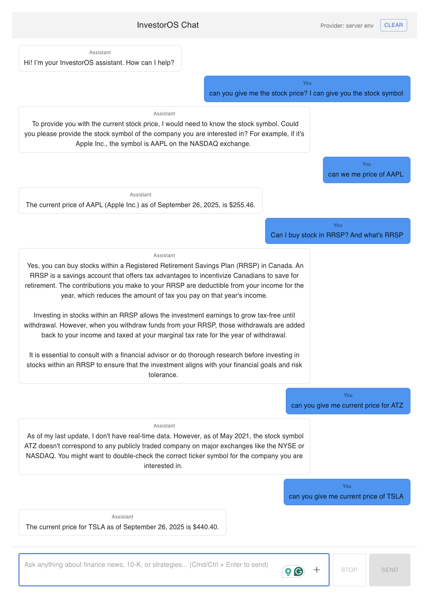

# 💼 InvestorOS Chat

> 💬 A local-first, streaming AI chat application built with React, Node.js, and Ollama.

InvestorOS Chat enables low-latency, streaming conversations with local LLMs (such as [Ollama](https://ollama.ai)) using **Server-Sent Events (SSE)**.  
This modular project is built to be developer-friendly, self-hostable, and privacy-preserving.

---

## ✨ Features

- ⚡ **Streaming responses** via Server-Sent Events (SSE)  
- 🔍 **Web search integration** (search live content from URLs)
- 📄 **PDF upload and embedding** for question answering
- 📈 **Stock quote retrieval** (e.g., "What is AAPL price today?")
- 🧩 **Modular architecture** (frontend + backend + model server)  
- 🎨 **Modern UI** powered by React + MUI  
- 🔌 **Backend API** with Express and robust SSE handling  
- 🤖 **LLM integration** with [Ollama](https://ollama.ai) (default: Mistral model)  
- 🛑 **Abortable requests** (cancel ongoing chat in real time)  
- 📜 **Chat history** with user + assistant roles  
- 📱 **Responsive layout** (desktop/mobile friendly)

---

## Demo

Here is a screenshot of InvestorOS in action:



## 🏗️ Architecture

```txt
React (frontend)
    |
    | fetch + SSE
    v
Express (backend) ---> Ollama API (localhost:11434)
```

- The **frontend** is a Vite + React app with MUI for UI components.
- The **backend** is a Node.js Express server that forwards chat prompts to the Ollama model.
- Responses are streamed back to the client using **Server-Sent Events (SSE)**.


## ✏️ Getting Started

### Prerequisites

- **Node.js (v18+)**
- **Ollama installed locally**  
  Install via Homebrew:

  ```bash
  brew install ollama
  ```

  Or from the [Ollama site](https://ollama.ai)

- **A model pulled locally**, for example:

  ```bash
  ollama pull mistral
  ```

---
### 💻 Frontend Setup

1. Navigate to the `client` directory:

    ```bash
    cd client
    ```

2. Install dependencies:

    ```bash
    npm install
    # or
    yarn install
    ```

3. Start the dev server:

    ```bash
    npm run dev
    # or
    yarn dev
    ```

    The frontend will usually be available at: [http://localhost:5173](http://localhost:5173) (Vite's default)

---
### ⚙️ Backend Setup

1. Navigate to the `server` directory:

    ```bash
    cd server
    ```

2. Install dependencies:

    ```bash
    npm install
    # or
    yarn install
    ```

3. Start the backend dev server:

    ```bash
    npm run dev
    # or
    yarn dev
    ```

    The backend runs on: [http://localhost:3000](http://localhost:3000)

---

## 🧠 Start Ollama (LLM)

To run the local LLM model, make sure [Ollama](https://ollama.ai) is installed and a model is pulled.

1. Pull the default model (e.g., Mistral):

    ```bash
    ollama pull mistral
    ```

2. Start the Ollama model server:

    ```bash
    ollama run mistral
    ```

    By default, this runs on `http://localhost:11434`

> You can also try other models:
> - `ollama pull llama2`
> - `ollama pull gemma`
> - `ollama pull phi`
>
> Then replace the `model` field in your API payload or config.

---

**✅ Important:** Ollama must be running *before* starting a chat request, otherwise the backend will fail to stream.


## 📁 Project Structure

```
InvestorOS/
├── client/                 # Frontend (React + Vite)
│   ├── src/
│   │   ├── pages/          # Chat UI components
│   │   ├── components/     # Shared UI widgets
│   │   └── utils/          # SSE logic, helpers
│   └── public/
│       └── screenshots/    # App screenshots
│
├── server/                 # Backend (Node.js + Express)
│   ├── routes/             # /stream endpoint
│   └── ollama/             # SSE proxy logic
│
├── .env.example            # Sample environment variables
├── README.md
└── package.json
```

---

## ✍️ Author

This project is primarily developed and maintained by: **Chaohao Zhu** 👋
